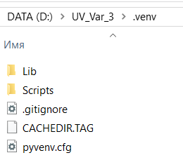
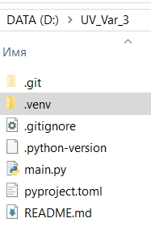

Тестирование пакетного менеджера UV
Алгоритм создания проекта с пакетным менеджером UV

Перед использованием убедитесь, что uv установлен
uv --version

если нет: то в cmd
pip install uv
Короткий путь создания проекта с UV
PS D:\GitHubTest1> uv init
Initialized project `githubtest1`
PS D:\GitHubTest1> uv run main.py
Using CPython 3.11.9 interpreter at: C:\PythonVersion\Python3119\python.exe
Creating virtual environment at: .venv
Hello from githubtest1!
PS D:\GitHubTest1> .venv\Scripts\activate
(githubtest1) PS D:\GitHubTest1>

🔹 Создаем виртуальное окружение
В корне проекта выполнить:

bash
uv venv .venv
→ Создаст папку .venv с изолированным Python-окружением.

🔹 Активируем окружение
Windows (PowerShell / CMD):

bash
.venv\Scripts\activate
результат
(.venv) D:\UV_Var_3>

Далее:
(.venv) D:\UV_Var_3>uv init

Initialized project `uv-var-3`

Файл .python-version содержит информацию о версии Python, используемой в проекте по умолчанию. Эта версия аналогична той, которая была установлена в системе на момент создания окружения. Файл pyproject.toml содержит информацию об установленных зависимостях:

Запуск Python-скриптов
(.venv) D:\UV_Var_3>uv run main.py
Hello from uv-var-3!

При первом запуске команды uv run, внутри venv будет создана директория .venv, содержащая устанавливаемые зависимости, используемые в окружении. Помимо этого, будет создан кроссплатформенный uv.lock файл.

Установка пакетов
Установка пакетов производится через команду add:

uv add requests
Если нужно установить более одного пакета:

uv add requests yt-dlp
Или если нужна специфичная версия:

uv add requests==2.31.0
